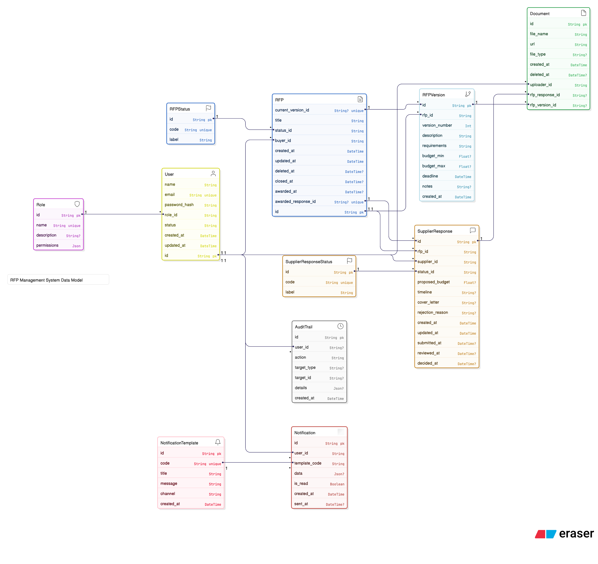

# Database Schema

This document outlines the database schema for the RFP management system, managed by Prisma.

## Database Design

## Models

### `RFPStatus`

Represents the status of an RFP.

| Field  | Type     | Description                                   |
|--------|----------|-----------------------------------------------|
| `id`   | `String` | Unique identifier (UUID).                     |
| `code` | `String` | Unique status code (e.g., Draft, Published, Closed, Awarded, Cancelled).  |
| `label`| `String` | Human-readable label for the status.          |
| `rfps` | `RFP[]`  | RFPs associated with this status.             |

**Status Lifecycle:**
- `Draft` → `Published` → `Closed` → `Awarded`
- `Draft`/`Published` → `Cancelled`
- `Published`/`Closed` → `Awarded` (when response awarded)

---

### `Role`

Represents a user role in the system (e.g., "Buyer", "Supplier").

| Field         | Type     | Description                                                 |
|---------------|----------|-------------------------------------------------------------|
| `id`          | `String` | Unique identifier for the role (UUID).                      |
| `name`        | `String` | The name of the role (e.g., "Buyer", "Supplier", "Admin"). Must be unique.        |
| `description` | `String?`| An optional description of the role.                        |
| `permissions` | `Json`   | A JSON object defining the permissions for this role.       |

**Available Roles:**
- **Buyer**: Can create, manage, and award RFPs
- **Supplier**: Can view and respond to published RFPs
- **Admin**: Full system access including user management, analytics, and system configuration
| `users`       | `User[]` | A list of users who have this role.                         |

---

### `User`

Represents a user of the application.

| Field               | Type                | Description                                                 |
|---------------------|---------------------|-------------------------------------------------------------|
| `id`                | `String`            | Unique identifier for the user (UUID).                      |
| `name`              | `String`            | The user's full name.                                       |
| `email`             | `String`            | The user's email address. Must be unique.                   |
| `password_hash`     | `String`            | The user's hashed password.                                 |
| `role_id`           | `String`            | Foreign key for the user's role.                            |
| `role`              | `Role`              | The role assigned to the user.                              |
| `status`            | `String`            | User status ('active' or 'inactive').                       |
| `created_at`        | `DateTime`          | Timestamp of when the user was created.                     |
| `updated_at`        | `DateTime`          | Timestamp of when the user was last updated.                |
| `rfps`              | `RFP[]`             | A list of RFPs created by the user (if Buyer).              |
| `supplier_responses`| `SupplierResponse[]` | A list of responses submitted by the user (if Supplier).   |
| `documents`         | `Document[]`        | A list of documents uploaded by the user.                   |
| `audit_trails`      | `AuditTrail[]`      | A list of audit trail entries related to the user's actions.|
| `notifications`     | `Notification[]`    | Notifications for this user.                                |

---

## System Features

### Authentication & Authorization
- **JWT-based Authentication**: Secure token-based authentication
- **Role-based Access Control (RBAC)**: Dynamic permissions stored in database with three roles: Buyer, Supplier, Admin
- **Permission Middleware**: Fine-grained access control with scopes and status checks
- **Admin Panel**: Complete administrative interface with system management capabilities

### Real-time Notifications
- **WebSocket Integration**: Socket.IO for real-time updates
- **Email Notifications**: SendGrid integration for email alerts
- **Event-driven Architecture**: Automatic notifications on status changes

### Document Management
- **File Upload**: Cloudinary integration for document storage
- **Version Control**: Document versioning and history tracking
- **Permission-based Access**: Role-specific document access

### Search & Filtering
- **Database Search**: Full-text search across RFP content
- **Advanced Filtering**: Multi-field filtering with pagination
- **Role-specific Views**: Different data views for buyers and suppliers

---

### `RFP`

Represents a Request for Proposal.

| Field               | Type                  | Description                                                 |
|---------------------|-----------------------|-------------------------------------------------------------|
| `id`                | `String`              | Unique identifier for the RFP (UUID).                       |
| `title`             | `String`              | The title of the RFP.                                       |
| `status_id`         | `String`              | Foreign key for the status.                                 |
| `status`            | `RFPStatus`           | The current status of the RFP.                              |
| `buyer_id`          | `String`              | Foreign key for the buyer.                                  |
| `buyer`             | `User`                | The buyer (User) who created the RFP.                       |
| `created_at`        | `DateTime`            | Timestamp of when the RFP was created.                      |
| `updated_at`        | `DateTime`            | Timestamp of when the RFP was last updated.                 |
| `closed_at`         | `DateTime?`           | Timestamp of when the RFP was closed.                       |
| `awarded_at`        | `DateTime?`           | Timestamp of when the RFP was awarded.                      |
| `awarded_response_id`| `String?`            | Foreign key for the awarded response.                       |
| `awarded_response`  | `SupplierResponse?`   | The response that was awarded.                              |
| `current_version_id`| `String?`            | Foreign key for the current version.                        |
| `current_version`   | `RFPVersion?`        | The current version of this RFP.                            |
| `versions`          | `RFPVersion[]`        | A list of versions of this RFP.                             |
| `supplier_responses`| `SupplierResponse[]`  | Responses submitted for this RFP.                           |

---

### `RFPVersion`

Represents a specific version of an RFP.

| Field            | Type        | Description                                                 |
|------------------|-------------|-------------------------------------------------------------|
| `id`             | `String`    | Unique identifier for the RFP version (UUID).               |
| `rfp_id`         | `String`    | Foreign key for the RFP.                                    |
| `rfp`            | `RFP`       | The RFP this version belongs to.                            |
| `version_number` | `Int`       | The version number.                                         |
| `description`    | `String`    | Description of the RFP.                                     |
| `requirements`   | `String`    | Requirements specified in the RFP.                          |
| `budget_min`     | `Float?`    | Minimum budget (optional).                                  |
| `budget_max`     | `Float?`    | Maximum budget (optional).                                  |
| `deadline`       | `DateTime`  | Deadline for the RFP.                                       |
| `notes`          | `String?`   | Optional notes for this version.                            |
| `created_at`     | `DateTime`  | Timestamp of when this version was created.                 |
| `documents`      | `Document[]`| Documents attached to this version.                         |

---

### `Document`

Represents a file uploaded to the system.

| Field               | Type                | Description                                                 |
|---------------------|---------------------|-------------------------------------------------------------|
| `id`                | `String`            | Unique identifier for the document (UUID).                  |
| `file_name`         | `String`            | The name of the file.                                       |
| `url`         | `String`            | The path where the file is stored.                          |
| `file_type`         | `String?`           | The MIME type of the file.                                  |
| `version`           | `Int`               | Version number of the document.                             |
| `created_at`        | `DateTime`          | Timestamp when uploaded.                                    |
| `uploader_id`       | `String`            | Foreign key for the uploader.                               |
| `uploader`          | `User`              | The user who uploaded the document.                         |
| `rfp_response_id`   | `String?`           | Foreign key for the supplier response.                      |
| `rfp_response`      | `SupplierResponse?` | The supplier response this document is associated with.     |
| `rfp_version_id`    | `String?`           | Foreign key for the RFP version.                            |
| `rfp_version`       | `RFPVersion?`       | The RFP version this document is attached to.               |
| `parent_document_id`| `String?`           | Foreign key for the parent document (for versioning).       |
| `parent_document`   | `Document?`         | Parent document.                                            |
| `versions`          | `Document[]`        | Different versions of this document.                        |

---

### `SupplierResponseStatus`

Represents the status of a supplier's response.

| Field      | Type                  | Description                                   |
|------------|-----------------------|-----------------------------------------------|
| `id`       | `String`              | Unique identifier (UUID).                     |
| `code`     | `String`              | Unique status code (e.g., Draft, Submitted, Under Review, Approved, Rejected, Awarded).  |
| `label`    | `String`              | Human-readable label.                         |
| `responses`| `SupplierResponse[]`  | Responses with this status.                   |

**Status Lifecycle:**
- `Draft` → `Submitted` → `Under Review` → `Approved`/`Rejected`
- `Approved` → `Awarded` (only one per RFP)

---

### `SupplierResponse`

Represents a response from a supplier to an RFP.

| Field           | Type                    | Description                                                 |
|-----------------|-------------------------|-------------------------------------------------------------|
| `id`            | `String`                | Unique identifier (UUID).                                   |
| `rfp_id`        | `String`                | Foreign key for the RFP.                                    |
| `rfp`           | `RFP`                   | The RFP this response is for.                               |
| `supplier_id`   | `String`                | Foreign key for the supplier.                               |
| `supplier`      | `User`                  | The supplier who submitted the response.                    |
| `status_id`     | `String`                | Foreign key for the status.                                 |
| `status`        | `SupplierResponseStatus`| The status of the response.                                 |
| `proposed_budget`| `Float?`               | Proposed budget (optional).                                 |
| `timeline`      | `String?`               | Proposed timeline (optional).                               |
| `cover_letter`  | `String?`               | Optional cover letter.                                      |
| `rejection_reason` | `String?`            | Reason for rejection (if rejected).                        |
| `documents`     | `Document[]`            | Documents attached to the response.                         |
| `created_at`    | `DateTime`              | When the response was created.                              |
| `updated_at`    | `DateTime`              | When the response was last updated.                         |
| `submitted_at`  | `DateTime?`             | When the response was submitted.                            |
| `reviewed_at`   | `DateTime?`             | When the response was reviewed.                             |
| `decided_at`    | `DateTime?`             | When the response was awarded.                              |
| `awarded_for_rfp` | `RFP?`               | Reverse relation for awarded response.                      |

---

### `AuditTrail`

Logs actions performed by users in the system.

| Field         | Type       | Description                                                 |
|---------------|------------|-------------------------------------------------------------|
| `id`          | `BigInt`   | Unique identifier (auto-increment).                         |
| `user_id`     | `String?`  | Foreign key for the user.                                   |
| `user`        | `User?`    | The user who performed the action.                          |
| `action`      | `String`   | The action performed (e.g., login, create_rfp).             |
| `target_type` | `String?`  | The type of object affected (e.g., RFP).                    |
| `target_id`   | `String?`  | ID of the affected object.                                  |
| `details`     | `Json?`    | Additional details about the action.                        |
| `created_at`  | `DateTime` | Timestamp of the action.                                    |

---

### `NotificationTemplate`

Represents a template for notifications.

| Field        | Type         | Description                                                 |
|--------------|--------------|-------------------------------------------------------------|
| `id`         | `String`     | Unique identifier (UUID).                                   |
| `code`       | `String`     | Unique code (e.g., RFP_PUBLISHED).                         |
| `title`      | `String`     | Notification title.                                         |
| `message`    | `String`     | Message with placeholders (e.g., {{rfp_title}}).            |
| `channel`    | `String`     | Delivery channel (EMAIL, IN_APP, BOTH).                     |
| `created_at` | `DateTime`   | When the template was created.                              |
| `notifications`| `Notification[]` | Notifications using this template.                   |

---

### `Notification`

Represents an actual notification sent to a user.

| Field         | Type                   | Description                                                 |
|---------------|------------------------|-------------------------------------------------------------|
| `id`          | `String`               | Unique identifier (UUID).                                   |
| `user_id`     | `String`               | Foreign key for the user.                                   |
| `user`        | `User`                 | The user receiving the notification.                        |
| `template_code`| `String`              | Foreign key for the template code.                          |
| `template`    | `NotificationTemplate` | The notification template.                                  |
| `data`        | `Json?`                | Runtime values to replace placeholders.                     |
| `is_read`     | `Boolean`              | Whether the notification has been read.                     |
| `created_at`  | `DateTime`             | When the notification was created.                          |
| `sent_at`     | `DateTime?`            | When the notification was sent (optional).                  |
